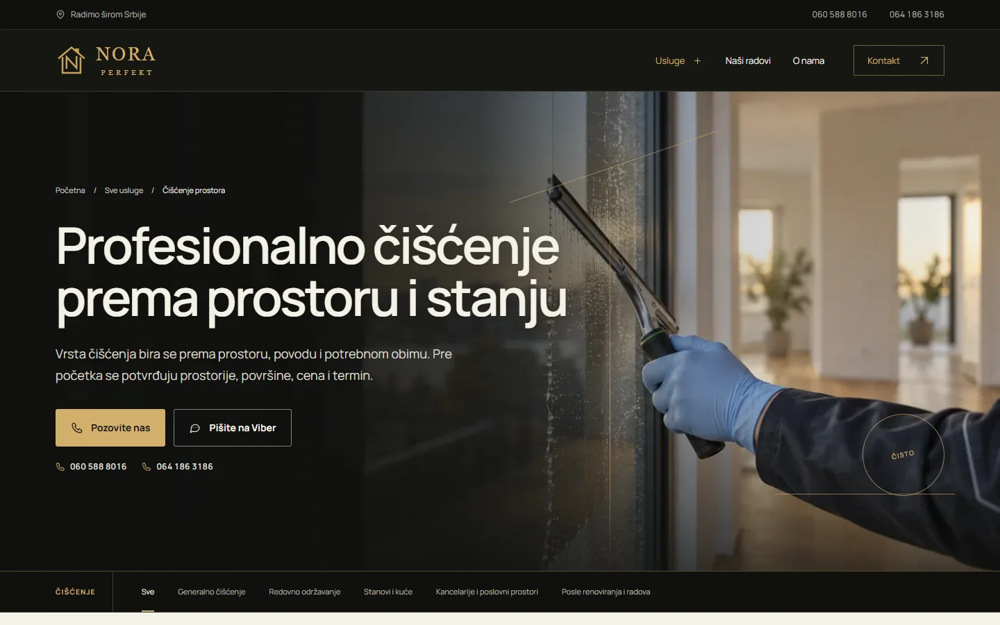
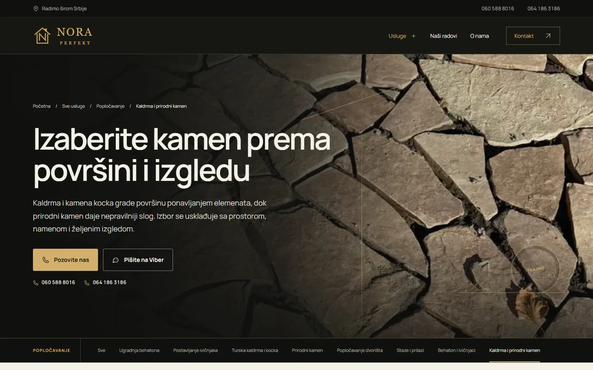

# Nora Perfekt

Sajt od 21 strane za firmu koja čisti stanove i poslovne prostore i postavlja kaldrmu i behaton širom Srbije, a obe usluge imaju istu težinu.

**[noraperfekt.rs](https://noraperfekt.rs/)** · [English](README.md)

> [!NOTE]
> Klijentski projekat. Izvorni kod pripada klijentu i čuva se u privatnom repozitorijumu. Ova stranica opisuje šta sam uradio i kako.

<table>
  <tr><td><b>Klijent</b></td><td>Nora Perfekt</td></tr>
  <tr><td><b>Delatnost</b></td><td>Čišćenje stambenih i poslovnih prostora i popločavanje kaldrmom, behatonom i prirodnim kamenom</td></tr>
  <tr><td><b>Lokacija</b></td><td>Srbija</td></tr>
  <tr><td><b>Vrsta</b></td><td>Sajt sa više strana</td></tr>
  <tr><td><b>Moj deo posla</b></td><td>Dizajn, izrada, SEO, hosting i održavanje</td></tr>
  <tr><td><b>Tehnologije</b></td><td>PHP, nginx, JSON-LD</td></tr>
</table>

## O projektu

Nora Perfekt radi dva posla koja se retko nađu na istom sajtu. Čisti stanove, kuće, kancelarije i prostor posle renoviranja, a postavlja tursku kaldrmu, kamenu kocku, behaton, ivičnjake i prirodni kamen u dvorištima, na stazama i prilazima. Firma ima sedište u opštini Lebane, a posao prihvata bilo gde u Srbiji. Svaki dogovor počinje pozivom ili fotografijama poslatim preko Vibera.

Nijedna usluga nije smela da izgleda kao dodatak onoj drugoj, pa sam svakoj dao glavnu stranu i podstrane, pet za čišćenje i osam za popločavanje. Naslovna im daje isti prostor, a u strukturisanim podacima vode se kao dva odvojena kataloga. Pošto firma radi po celoj zemlji, strane su pisane za pretrage iz cele Srbije.

## Šta sam uradio

- 21 strana: glavna strana i podstrane za svaku uslugu, uz radove, o nama, kontakt i politiku privatnosti
- Dugmad za poziv i Viber za oba broja, uz kratku napomenu za telefone bez Vibera
- Galerija radova sa uvećanim prikazom svake fotografije
- Meni za telefon i animacije koje staju kada sistem traži manje pokreta
- Automatske provere linkova, medija i sigurnosnih zaglavlja pre svakog objavljivanja
- Strukturisani podaci za firmu, sa čišćenjem i popločavanjem kao dva kataloga usluga

## Merenja

| | Performanse | Pristupačnost | Dobre prakse | SEO |
| :-- | :-: | :-: | :-: | :-: |
| Telefon | 98 | 100 | 100 | 92 |
| Desktop | 100 | 100 | 100 | 92 |

Lighthouse, laboratorijsko merenje živog sajta, septembar 2026.

## Snimci ekrana

<table>
  <tr>
    <td width="68%" valign="top"></td>
    <td width="32%" valign="top"></td>
  </tr>
</table>

Čišćenje, pregled svih usluga

Kaldrma i prirodni kamen

---

Izrada: [D. Svilenković](https://svilenkovic.rs).
